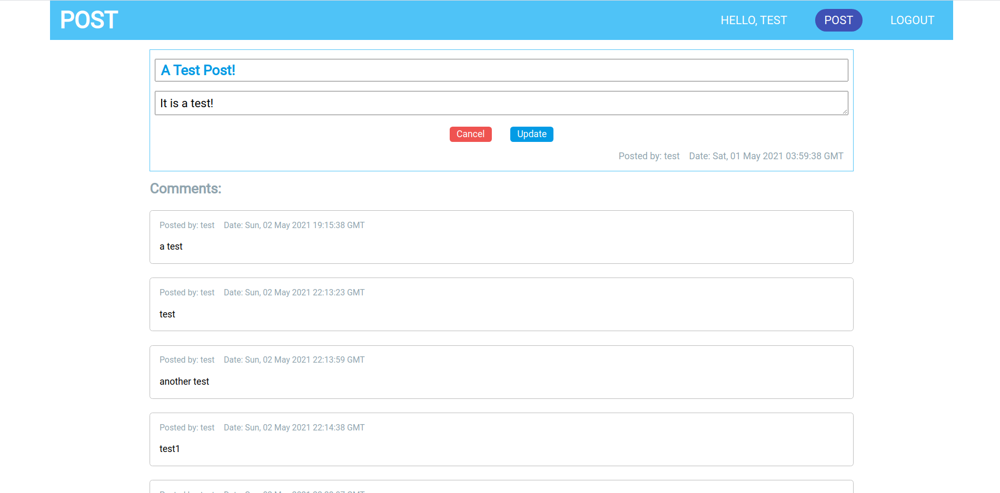

# Posts!
A website for users to create post and share comments.

The website is built with React, mysql and I use JSON Web Token(jwt) to authenticate users.

The backend uses Express js.

Here is the home page looks like:

### Database
This project uses mysql. There are 3 tables: users, posts and comments. 

### Features
Users can register and log in with their emails.
Login page

Register page

After logged in, the navbar will look like this:

user can create a new post by clicking the post button in navbar:

users can click on their names from the navbar to view their own posts:

The detail page of a post, logged in users can leave a comment under each post:

If you are the author of the post, you will have a edit button, and you can update the post:

